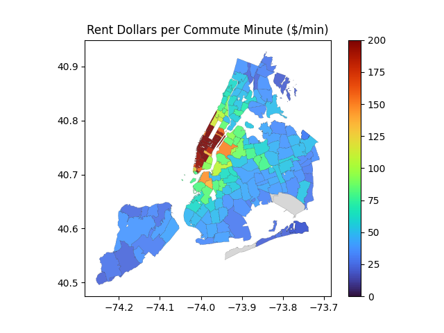

# NYC Rent + Commute Heatmap

This project visualizes median rent and estimated commute time across NYC neighborhoods, helping renters identify areas with optimal trade-offs between cost and travel time.

## Project Goals

- Visualize rent and commute time at the ZIP level
- Combine multiple layers into a score-based ranking
- Create a foundation for future interactive dashboards

### Dependencies

Built using Python 3.10, GeoPandas, Pandas, Matplotlib.

## Data Sources

- HUD Median Rent Estimates (2025) — [huduser.gov](https://www.huduser.gov/portal/datasets/fmr.html)
- NYC NTA Shapefiles — [NYC Open Data Portal](https://data.cityofnewyork.us)
- [Planned] Google Maps Directions API (https://developers.google.com/maps/documentation/directions) — for commute time estimation

## Current Features

- Real-time commute estimates per ZIP code, based on Google API
- High-Res ZIP-level Rent estimates (0-4 BR)
- Experimental scoring metric S: Dollars Paid (for Rent) per Commute Time (to Times Square)
- Geospatial visualization of Scores per area
- Retry logic has been added, and also checks for free-tier limits
- Randomized, placeholder commute data to test pipeline (REMOVED)
- Optional, Borough-level Rent estimates (0-4 BR) (REMOVED)

## Getting Started
Currently not packaged — rerun scripts in `scripts/` manually. Main script is NYCRentHeatmap.py. Env file and API key required for commute data.

### Caching
- Final merged GeoDataFrame is saved to `outputs/zcta_rent_commute.geojson`
- If this file exists and `OVERWRITE` is set to `False`, the script will skip data loading/transformation.
- Added caching to monitor free monthly API allowance

### Updates

#### Google Maps API completed

[Rent per GMaps Commute Time](v1.0_RentPerCommute_LiveAPI.png)

#### ZCTA Upgrade completed

[Rent per Zip, using Google Commute Time](v1.1_RentPerCommute_perZip.png)

#### Display Configs added

[Display configs added to simplify & scale mapping](v1.2_ScorePerZip.png)

## Future Plans

- Normalize scoring metrics
- Add map layer interactivity (dropdown menu for toggling views)
- Explore subway access or walkability overlays
- Add options for Departure Time, other inputs
- Add multi-destination functionality

### Future Branches

- RealTime Rent: Explore scraping options
- MTA Analysis: Explore MTA data
- Caching & Retry Logic: add smart API caching, avoid duplicate calls, respect usage limits
- Dashboard/UI Layer: Optional final layer to add

## File Structure

- `scripts/` – processing + analysis code
- `config/` - code used for configs, like plotting defaults
- `data/` – shapefiles and downloaded datasets
- `output/` – merged GeoJSONs, CSV exports
- `lib/` - now holds utils, which contains common functions
- `README.md` – project overview and goals

### Version Milestones
- `v1.0`: Borough-level rent & fake commute data
- `v1.1-zcta-rent`: ZIP-level rent upgrade with real commute API
- `v1.2-plot-config`: Added config settings to help display & scale

## Author Notes

This is a personal geospatial project designed to test interactive data visualization and real-world planning tools using open data.
